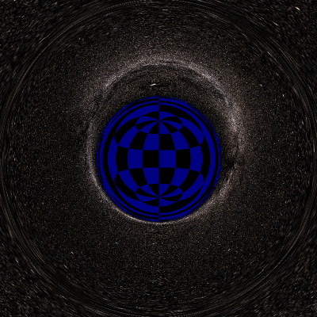
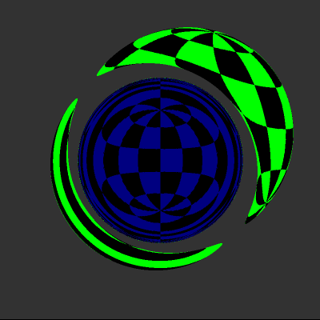

# riemann-ray
弯曲时空中的光线跟踪。

光线在引力场中会发生偏折，如中子星和黑洞附近，造成一些有趣的光学现象。我们可以使用光线跟踪的方法来渲染出当黑洞等强引力源存在时的三维场景。

光线跟踪的原理非常类似于一般平直时空中的情形，只不过光线不再是直线而是类光测地线，可以通过解测地线方程数值解的方式来近似得到光的路径，并与空间中的物体做碰撞测试。

下面是一些渲染结果。（多图预警！）

## 史瓦西时空
史瓦西时空描述的是不带电且不旋转的黑洞。光线在其中的运动规律较为简单，可看作质点在一个中心势场中的运动。

第一个关于黑洞的有趣现象是我们可以看到黑洞的整个视界面，这是黑洞弯曲光线的结果。

上图中视界半径是0.5，位于视界处的球的贴图是蓝黑相间的色块半径为0.51，略大于视界。黑洞后面的星空被引力扭曲了，在黑洞后面放一个球体可以更清楚地看到这种效应：

即使球体的半径小于视界也能被引力透镜效应显示出来，下图中球体的半径与视界相同：

下面是一个球体从黑洞后面经过的动画。

一个球体部分没入黑洞：

实际中的黑洞一般会有吸积盘。如果在黑洞周围加上模拟的“吸积盘”：

看到的景象会是这样：

很像《星际穿越》里黑洞的吸积盘，不是么？

1.5倍引力半径处是一个特殊的球面，称为*光球（photon sphere）*，光线在这个球面上会做圆周运动。但这个运动是不稳定的，只有当光线严格位于此球面上时才会有圆运动，稍有偏差就会落入黑洞或逃逸到无穷远处。因此如果将摄像机沿切线方向放在光球处，照片的下半部分就会是黑洞视界，上半部分是星空。

继续靠近黑洞的视界，照片中视界部分就会多于星空，使得看起来好像黑洞和星空交换了位置。在很接近视界的地方将摄像头对准天空，会看到天空集中到了一个圆里面，圆外是黑暗的深渊，很像球极投影：

越靠近视界这个圆就会越小，当到达视界时会变成一个点。

## Reissner–Nordström时空与裸奇点
如果黑洞带有电荷，史瓦西时空就变为了Reissner–Nordström时空。简单地想，带电的黑洞在离中心奇点较远的区域和不带电黑洞一样对光线和检验粒子表现为引力，而很接近奇点时表现为斥力，这就使得它有内外两个视界。当电荷足够大时内外视界重合，将奇点暴露在外，成为*裸奇点*。下图是有裸奇点存在时的星空。

一个球体在裸奇点后面移动：

一个球体向裸奇点移动：

## 鸣谢
星空地图来自[NASA SVS](//svs.gsfc.nasa.gov/3572)。